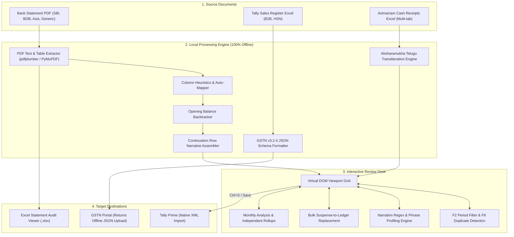
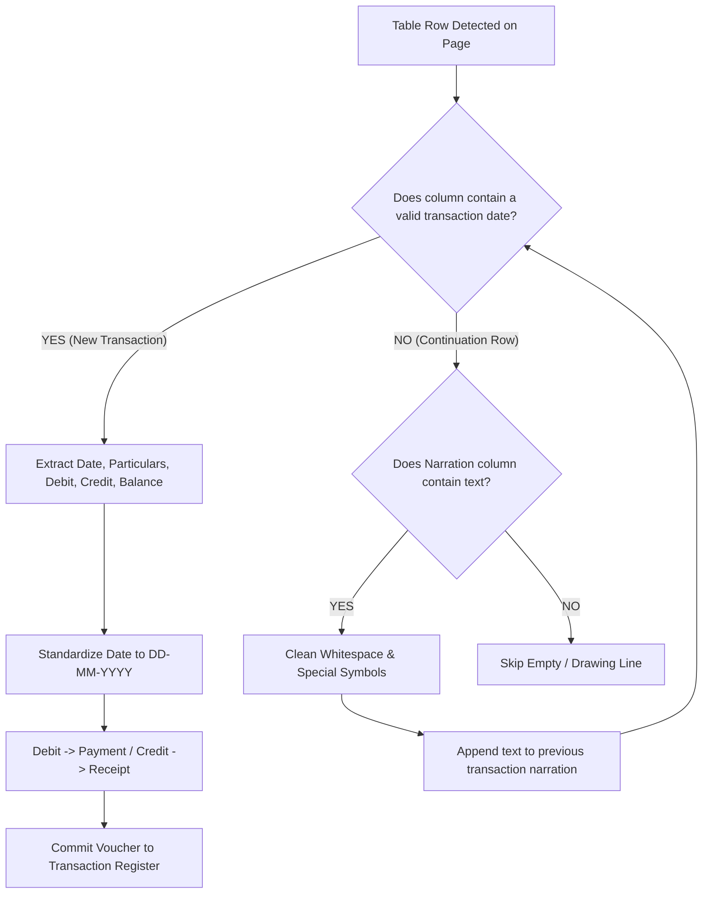
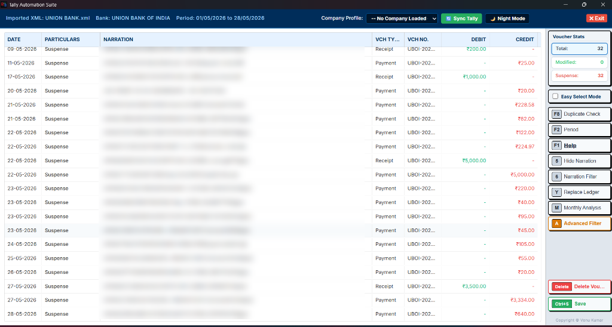
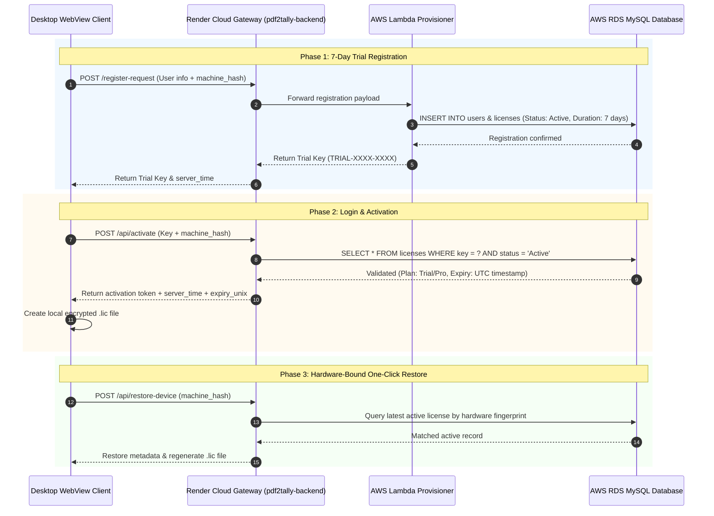

# PDF2TALLY — Professional Offline Tally XML Automation Suite

<div align="center">

[](LICENSE)
[](https://pdf2tally-backend.onrender.com/)
[](https://pdf2tally-backend.onrender.com/)
[](https://pdf2tally-backend.onrender.com/)
[](https://pdf2tally-backend.onrender.com/)
[](https://pdf2tally-backend.onrender.com/)

</div>

> [!CAUTION]
> **PROPRIETARY & CONFIDENTIAL SOURCE-AVAILABLE REPOSITORY**  
> This repository is **NOT open-source software**. Access to view this code is granted strictly for personal, educational code review, security audit, and evaluation purposes only. Copying, cloning, modifying, redistributing, or unauthorized commercial exploitation is strictly prohibited without prior express written permission from **Venu Kumar**. See the full [LICENSE](LICENSE) for details.

<div align="center">

**Automate complex bank statement conversions, voucher audits, GSTR-1 returns, and regional cash ledgers into standard Tally XML in seconds — with absolute local privacy.**

[🌐 Visit Official Website & Cloud Gateway](https://pdf2tally-backend.onrender.com/) • [📥 Download 7-Day Trial](https://pdf2tally-backend.onrender.com/#download) • [📺 Watch Video Demo](https://youtu.be/UojQd1Z5CBM)

---

</div>

## 📑 Table of Contents
- [1. Executive Summary & Problem Solved](#1-executive-summary--problem-solved)
- [2. System Architecture & Flowcharts](#2-system-architecture--flowcharts)
  - [2.1 End-to-End Processing Pipeline](#21-end-to-end-processing-pipeline)
  - [2.2 Bank Parsing & Continuation Engine](#22-bank-parsing--continuation-engine)
- [3. Interactive Voucher Review Desk](#3-interactive-voucher-review-desk)
  - [3.1 Review Desk Visual Interface](#31-review-desk-visual-interface)
  - [3.2 Core Review Desk Features](#32-core-review-desk-features)
  - [3.3 Narration Filtering & Regex Intelligence](#33-narration-filtering--regex-intelligence)
  - [3.4 Advanced Filter (Phrase Frequency Text-Mining)](#34-advanced-filter-phrase-frequency-text-mining)
  - [3.5 Monthly Analysis & Balance Rollups](#35-monthly-analysis--balance-rollups)
  - [3.6 In-Place DOM Mutation & Export](#36-in-place-dom-mutation--export)
- [4. Licensing System & Cloud Gateway Architecture](#4-licensing-system--cloud-gateway-architecture)
  - [4.1 Reverse Proxy Gateway Pattern](#41-reverse-proxy-gateway-pattern)
  - [4.2 Licensing Sequence Flow](#42-licensing-sequence-flow)
  - [4.3 Hardware Fingerprinting & Machine Binding](#43-hardware-fingerprinting--machine-binding)
  - [4.4 Anti-Tampering Monotonic Offline Decay](#44-anti-tampering-monotonic-offline-decay)
  - [4.5 Licensing Endpoints Reference](#45-licensing-endpoints-reference)
- [5. Bank Statement Parsers & Universal Hybrid Engine](#5-bank-statement-parsers--universal-hybrid-engine)
  - [5.1 Direct Bank Parsers (SBI, BOB, Axis)](#51-direct-bank-parsers-sbi-bob-axis)
  - [5.2 Universal Hybrid Generic Table Engine](#52-universal-hybrid-generic-table-engine)
  - [5.3 Backtracked Opening Balance Math](#53-backtracked-opening-balance-math)
- [6. GST Offline Ingestion (GSTR-1 & HSN)](#6-gst-offline-ingestion-gstr-1--hsn)
  - [6.1 GSTR-1 B2B Offline Generator](#61-gstr-1-b2b-offline-generator)
  - [6.2 HSN / SAC Summary Generator](#62-hsn--sac-summary-generator)
- [7. Ashramam Cash Receipts & Aksharamukha Transliteration](#7-ashramam-cash-receipts--aksharamukha-transliteration)
- [8. System Paths & Storage Directory Reference](#8-system-paths--storage-directory-reference)
- [9. Developer Guide & Build Instructions](#9-developer-guide--build-instructions)

---

## 1. Executive Summary & Problem Solved

Accounting and audit professionals spend dozens of hours every month manually typing bank transaction entries, reconciliation ledgers, and return filings into **Tally Prime**. Manual entry is not only tedious and cost-inefficient, but it also introduces critical data entry mistakes, inverted debit/credit signs, and duplicate vouchers. 

While cloud-based converters exist, uploading client bank statements and ledgers to third-party web servers introduces severe **compliance liabilities, privacy risks, and data leakage threats**.

**PDF2TALLY** bridges this gap:
- **100% Offline-First Execution**: All PDF reading, regex tokenization, OCR parsing, voucher generation, and XML exports run strictly on the local machine's CPU. Your confidential financial data never leaves your computer.
- **Universal Bank Support**: Built-in automated parsers for major financial institutions (SBI, Bank of Baroda, Axis) combined with an intelligent **Hybrid Generic Table Engine** capable of ingesting any standard table-structured statement PDF.
- **Interactive Review Desk**: An in-app Tally-style workspace where accountants can audit transactions, conduct duplicate detection, bulk-replace suspense accounts using smart text-mining, and analyze monthly cash flows prior to exporting.
- **Instant Tally Ingestion**: Exports standard XML schemas that import directly into Tally Prime via its native `Import > Transactions` menu.
- **Official GST & HSN Formatting**: Transforms Excel sales registers into official GSTN portal JSON v3.2.4 packages.
- **Zero Cloud Exposure**: Cloud interaction is limited strictly to lightweight license verification and update pings via the official [PDF2TALLY Cloud Gateway](https://pdf2tally-backend.onrender.com/).

---

## 2. System Architecture & Flowcharts

### 2.1 End-to-End Processing Pipeline

The following flowchart illustrates how raw statement files, Excel sales logs, and cash receipt workbooks flow through PDF2TALLY into Tally Prime and government portals:



### 2.2 Bank Parsing & Continuation Engine

Bank statements frequently break narrative text across multiple lines. The parsing engine distinguishes between new transaction rows and multi-line continuations:



---

## 3. Interactive Voucher Review Desk

The **Voucher Review Desk** is the flagship auditing and batch-editing workspace of PDF2TALLY. Designed specifically around the keyboard-driven UX conventions of **Tally Prime**, it allows accountants to review, filter, categorize, and deduplicate thousands of transactions before writing them to the final Tally XML file.

### 3.1 Review Desk Visual Interface

Below is a live preview of the Review Desk auditing a Union Bank of India statement. *(Sensitive transaction narration details, account numbers, and UPI handles have been blurred for data confidentiality)*:

<div align="center">



*Figure 1: Full-Screen Voucher Review Desk featuring Tally Prime color schemes, virtual scrolling viewport, side function panel, and real-time statistics tracker.*

</div>

### 3.2 Core Review Desk Features

| Shortcut | Feature | Description |
| :---: | :--- | :--- |
| **`F2`** | **Period Filter** | Set custom start and end date ranges to isolate specific financial periods, quarters, or tax months. |
| **`Y`** | **Replace Ledger** | Bulk replaces the default `Suspense` ledger across all selected vouchers with verified Tally account ledgers. |
| **`M`** | **Monthly Analysis** | Generates an aggregated chronological summary grouped by calendar month with cumulative rolling balances. |
| **`F8`** | **Duplicate Check** | Scans all vouchers for identical combinations of date, amount, and narration to eliminate double imports. |
| **`6`** | **Narration Filter** | Launches a quick multi-word regex search across all voucher narrations. |
| **`A`** | **Advanced Filter** | AI-style text-mining engine that extracts and counts recurring phrase frequencies across transactions. |
| **`5`** | **Hide Narration** | Toggles the narration column visibility to provide a compact view of dates, ledgers, and voucher amounts. |
| **`Delete`** | **Delete Voucher** | Removes selected erroneous or contra rows directly from the voucher registry. |
| **`Ctrl + S`** | **Save & Export** | Serializes the modified in-browser DOM tree directly to a clean Tally-compliant XML file. |
| **`Night Mode`** | **Theme Switcher** | Toggles between Tally Classic Light and Tally Prime Slate Dark (`.tally-night-mode`). |

---

### 3.3 Narration Filtering & Regex Intelligence

Traditional substring filters fail when bank statements introduce variable spaces, slashes, or special symbols. The Review Desk dynamically tokenizes user queries into whitespace-agnostic regular expressions:

```javascript
// Whitespace-agnostic multi-word regex compiler
function compileNarrationRegex(inputKeyword) {
    const words = inputKeyword.toLowerCase().trim().replace(/\s+/g, " ").split(" ").filter(Boolean);
    if (words.length === 0) return null;
    
    // Escape all regex-specific symbols
    const escapedWords = words.map(w => w.replace(/[.*+?^${}()|[\]\\]/g, '\\$&'));
    
    // Join tokens with arbitrary whitespace matcher (\s+)
    return new RegExp(escapedWords.join("\\s+"), "i");
}
```

This guarantees that searching for `"zomato order"` matches `"ZOMATO  ORDER"`, `"ZOMATO/ORDER"`, or `"ZOMATO ORDER #4912"`.

---

### 3.4 Advanced Filter (Phrase Frequency Text-Mining)

Rather than forcing users to guess what vendors or recurring payments are inside a 500-page statement, the **Advanced Filter** performs automated text-mining:

1. **Stop-Word Elimination**: Removes banking noise words (`upi`, `neft`, `rtgs`, `imps`, `transfer`, `bank`, `account`, `ref`, `payment`, `dr`, `cr`).
2. **N-Gram Tokenization**: Generates 1-word, 2-word, and 3-word phrase candidates from every narrative line.
3. **Frequency Aggregation**: Computes the exact occurrence counts across all transactions.
4. **Instant Bulk Ledger Assignment**: Selecting any identified phrase (e.g. `zomato`, `swiggy`, `petrol pump`, `salary`, `interest credit`) filters all matching rows instantly. Pressing **`Y`** reassigns hundreds of vouchers to their proper expense ledger in one click.

---

### 3.5 Monthly Analysis & Balance Rollups

The Review Desk provides instantaneous financial period rollups with two distinct calculation methodologies:

- **Standard Banking Mode**:
  $$\text{Closing Balance}_m = \text{Opening Balance}_m + \sum \text{Debits}_m - \sum \text{Credits}_m$$
  Balances roll forward cumulatively from the initial bank statement opening balance.
- **Ashramam / Cash Mode**:
  Calculates independent monthly receipt totals without rolling forward balances, maintaining standalone monthly cash collections.

---

### 3.6 In-Place DOM Mutation & Export

Unlike tools that re-render and re-parse on the backend, PDF2TALLY modifies the live XML Document Object Model directly inside the client engine:

```javascript
// Mutates both the reactive UI state and the actual XML DOM tree in-place
function replaceLedgerForSelected(newLedgerName) {
    reviewState.selectedIds.forEach(id => {
        const vch = reviewState.vouchers.find(v => v.id === id);
        if (!vch) return;

        vch.particulars = newLedgerName;
        vch.modified = true;

        // In-place XML Node update
        const partyLedNameNode = vch.node.querySelector("PARTYLEDGERNAME");
        if (partyLedNameNode) partyLedNameNode.textContent = newLedgerName;

        const entries = vch.node.querySelectorAll("ALLLEDGERENTRIES\\.LIST, LEDGERENTRIES\\.LIST");
        entries.forEach(ent => {
            const ledNameNode = ent.querySelector("LEDGERNAME");
            if (ledNameNode && !/bank|sbi|bob|axis|cash|hdfc|icici/i.test(ledNameNode.textContent)) {
                ledNameNode.textContent = newLedgerName;
            }
        });
    });
}
```

When saving, the XML DOM is serialized via `XMLSerializer` and downloaded immediately without loss of fidelity.

---

## 4. Licensing System & Cloud Gateway Architecture

PDF2TALLY implements an enterprise-grade **Online-Syncing and Monotonic-Offline-Decay** licensing framework.

### 4.1 Reverse Proxy Gateway Pattern

To protect backend cloud resources, the client application never interacts directly with internal database endpoints or AWS infrastructure. Instead, requests flow through a secure **Reverse Proxy Gateway** hosted on Render:

- **Official Web Portal & Gateway**: [https://pdf2tally-backend.onrender.com/](https://pdf2tally-backend.onrender.com/)
- **Zero Client Rebuilds**: Backend URL rotations, database migrations, or Lambda upgrades are managed in the Render dashboard without requiring client executable updates.
- **Credential Isolation**: Client executables contain zero database passwords, API keys, or AWS IAM credentials.

---

### 4.2 Licensing Sequence Flow

The following sequence diagram details the communication between the local desktop app, the Render gateway, AWS Lambda, and the RDS database:



---

### 4.3 Hardware Fingerprinting & Machine Binding

Each installation generates a unique cryptographic signature derived from the physical motherboard UUID, BIOS serial number, and CPU ID:
- Prevents copying `.lic` activation files between different workstations.
- Supports single-click license restoration on clean reinstallations via the `/api/restore-device` endpoint.

---

### 4.4 Anti-Tampering Monotonic Offline Decay

To allow users to work offline without allowing system clock manipulation (e.g. rolling back Windows system time to bypass license expiry), PDF2TALLY uses a hardware-level **Monotonic Clock Ledger**:

1. **Server Baseline Anchor**: On startup and check-in, the application receives verified absolute UTC time from the Render server:
   $$T_{\text{baseline}} = \text{server\_time}$$
2. **CPU Monotonic Tick Offset**: The application reads raw hardware CPU cycles via `time.monotonic()`:
   $$M_{\text{baseline}} = \text{time.monotonic}()$$
3. **Current Time Calculation**:
   $$T_{\text{current}} = T_{\text{baseline}} + (M_{\text{current}} - M_{\text{baseline}})$$
4. **Anti-Clock-Tampering Guarantee**: Because `time.monotonic()` measures CPU oscillator pulses directly from system hardware, changing the Windows calendar or system clock has zero effect on license decay.
5. **Periodic State Persistence**: As the software runs, it saves the validated monotonic elapsed time to the local encrypted `.lic` file.

> [!IMPORTANT]
> The app requires an internet connection on launch to synchronize with the server and establish a new baseline anchor. Once logged in, all conversions and reviews run completely offline.

---

### 4.5 Licensing Endpoints Reference

All client licensing requests are routed via [https://pdf2tally-backend.onrender.com/](https://pdf2tally-backend.onrender.com/):

| Endpoint | Method | Payload | Function |
| :--- | :---: | :--- | :--- |
| `/register-request` | `POST` | `name`, `email`, `phone`, `machine_hash` | Generates a free 7-day trial key and registers user in RDS. |
| `/api/activate` | `POST` | `license_key`, `machine_hash` | Binds the key to machine hardware, returns expiration tokens. |
| `/api/restore-device` | `POST` | `machine_hash` | Restores an existing active license for the current machine. |
| `/api/request-renewal` | `POST` | `license_key`, `notes` | Submits a renewal extension ticket for administrative approval. |

---

## 5. Bank Statement Parsers & Universal Hybrid Engine

### 5.1 Direct Bank Parsers (SBI, BOB, Axis)

Pre-configured, zero-setup direct parsers are included for major national banks:
- **State Bank of India (SBI)**: Ingests digital multi-page statements, resolves two-line transaction narratives, and handles overdraft limits.
- **Bank of Baroda (BOB)**: Fully automated extraction of transaction tables, deposits, withdrawals, and closing balances.
- **Axis Bank**: Native parsing of structured transaction grids.

---

### 5.2 Universal Hybrid Generic Table Engine

For all other banks, PDF2TALLY features a **Universal Hybrid Parser** that dynamically maps any tabular PDF bank statement.

#### 1. Decoy & Vector Filtering
Bank statements frequently feature bank logos, disclaimer boxes, and address grids on Page 1. The hybrid engine filters decoys by enforcing strict validation:
- **Row Count**: Must contain a header row plus at least one transaction row ($R > 1$).
- **Column Count**: Must contain at least 5 columns (standard matrix for financial ledgers).
- **Content Verification**: Ignores empty vector boxes and drawing lines (e.g. Union Bank header shape).

#### 2. Auto-Mapping Keyword Heuristics
The parser inspects row index `0` and auto-maps columns based on comprehensive keyword dictionaries:

| Mapped Field | Recognized Header Keywords (Case-Insensitive) |
| :--- | :--- |
| **Date** | `date`, `txn date`, `transaction date`, `value date`, `post date`, `txn. date`, `val dt` |
| **Narration** | `narration`, `description`, `particulars`, `remarks`, `details`, `transaction particulars` |
| **Debit** | `debit`, `withdrawal`, `withdrawals`, `dr`, `payment`, `payments`, `debit amount`, `amount (dr)` |
| **Credit** | `credit`, `deposit`, `deposits`, `cr`, `receipt`, `receipts`, `credit amount`, `amount (cr)` |
| **Balance** | `balance`, `closing balance`, `available balance`, `running balance`, `bal`, `running bal` |

---

### 5.3 Backtracked Opening Balance Math

If the bank statement does not explicitly state the starting balance in its summary metadata, the engine mathematically backtracks it from the first transaction row:

$$\text{Opening Balance} = \text{Balance}_1 + \text{Debit}_1 - \text{Credit}_1$$

- **Overdraft Indicators**: Correctly interprets `OD`, `DR`, `Dr`, `-` as negative balance values.
- **Single-Column Sign Resolution**: For statements that combine debits and credits into one column with trailing sign suffixes (`1000.00 Cr` vs `500.00 Dr`), the parser splits amounts automatically.

---

## 6. GST Offline Ingestion (GSTR-1 & HSN)

PDF2TALLY includes dedicated conversion utilities to prepare compliant government portal returns directly from Excel exports, completely bypassing manual CSV entry.

### 6.1 GSTR-1 B2B Offline Generator

- **Sheet Target**: `b2b` (case-insensitive)
- **Header Detection**: Row index 4 (`header=3`)
- **Column Ordering**: Header-driven lookup (order of physical columns in Excel does not matter)
- **Required Columns**:
  - `GSTIN/UIN of Recipient`
  - `Invoice Number`
  - `Invoice date` (`dd-mm-yyyy` or `dd/mm/yyyy`)
  - `Invoice Value` (tax-inclusive gross amount)
  - `Place Of Supply` (state code prefix, e.g. `37-Andhra Pradesh` or `37`)
  - `Taxable Value`
  - `Rate` (tax slab percentage, e.g. `18` or `18%`)
- **Output**: Generates standardized JSON compliant with **GST Portal Offline Schema v3.2.4**.

---

### 6.2 HSN / SAC Summary Generator

- **Sheet Target**: `hsn` (case-insensitive)
- **Dynamic Section Dividers**: Automatically detects grid transitions when encountering separator rows containing `B2B Supplies` or `B2C Supplies`.
- **Accepted Header Aliases**:
  - HSN: `hsn`, `hsn code`, `hsn/sac`
  - Description: `description`, `desc`
  - UQC: `uqc`, `unit`, `uom` (defaults to `NOS` / `OTH`)
  - Quantity & Value: `qty`, `taxable value`, `cgst`, `sgst`, `igst`, `cess`

---

## 7. Ashramam Cash Receipts & Aksharamukha Transliteration

A specialized offline ingestion module built for religious trusts, ashramams, and charitable institutions handling physical receipt registers in regional languages.

### Strict Physical Column Order (Columns A to E)

| Index | Column | Field | Logic & Normalization |
| :---: | :---: | :--- | :--- |
| **0** | **A** | **Date / Day** | Supports full date (`dd.mm.yy`) or day fragments (`02`, `15`). Carries forward day from previous row if blank. |
| **1** | **B** | **Receipt No** | Unique receipt number. Skipped if empty. |
| **2** | **C** | **Donor Name** | Telugu or English script. Strips Telugu honorific suffixes (`గారు`, `గారూ`) and transliterates phonetically. |
| **3** | **D** | **Phone No** | Stored for audit; excluded from Tally accounting voucher lines. |
| **4** | **E** | **Amount** | Donation sum (₹). Generates Cash Receipt voucher (Debit: Cash, Credit: Donation). |

### Aksharamukha Transliteration & Lexicon Cache
- **Phonetic Conversion**: Transliterates Telugu Unicode characters into standard English ASCII representations.
- **Local Dictionary Cache**: Translated donor names are cached at `~/.pdf2tally/telugu_mappings.json`. Repeated names are retrieved instantly from the local dictionary without reprocessing.
- **Diacritic Stripping**: Automatically converts accented characters (`ā`, `ś`, `ṇ`) into clean Latin characters (`a`, `s`, `n`) for flawless Tally ledger matching.

---

## 8. System Paths & Storage Directory Reference

All persistent application data, licenses, caches, and diagnostics are stored strictly under the standard Windows local user profile:

`C:\Users\<Username>\AppData\Local\PDF2TALLY\`

| Category | File / Subdirectory Path | Technical Purpose |
| :--- | :--- | :--- |
| **🔑 License Key** | `...\AppData\Local\PDF2TALLY\.lic` | XOR-encrypted offline license token and hardware signature record. |
| **📋 Saved Layouts** | `...\AppData\Local\PDF2TALLY\saved_layouts.json` | User-defined column mappings for hybrid bank layouts. |
| **🔤 Telugu Cache** | `...\AppData\Local\PDF2TALLY\telugu_mappings.json` | Aksharamukha lexicon dictionary for Telugu name transliterations. |
| **🏦 Tally Ledgers** | `...\AppData\Local\PDF2TALLY\tally_companies\` | Synchronized local Tally Prime company ledger caches. |
| **📄 Temp Uploads** | `...\AppData\Local\PDF2TALLY\temp_uploads\` | Session scratch directory for uploaded PDF statements. |
| **🪵 Runtime Log** | `...\AppData\Local\PDF2TALLY\logs\app.log` | Diagnostic execution logs, hardware hash logs, and API routes. |
| **🪵 Fulltext Dump** | `...\AppData\Local\PDF2TALLY\logs\fulltext.log` | Raw text stream extracted by PyMuPDF / pdfplumber for debugging. |

### Standalone Program Directory

When installed via setup, executable binaries and dependencies reside in:
`C:\Program Files (x86)\PDF2TALLY\`
- `PDF2TALLY.exe`: Main entry point container.
- `_internal/`: Embedded Python runtime, bundled libraries, and web assets.
- `unins000.exe`: Clean uninstaller executable.

---

## 9. Developer Guide & Build Instructions

### Prerequisites
- **Python**: 3.10, 3.11, or 3.12 (64-bit recommended)
- **Microsoft Edge WebView2 Runtime** (installed by default on Windows 10/11)
- **Tally Prime** (for native XML import testing)

### Local Environment Setup

1. **Clone repository & navigate to directory**:
   ```powershell
   cd c:\Users\<Username>\Desktop\pdf2tally3_trial\pdf2tally
   ```

2. **Create and activate virtual environment**:
   ```powershell
   python -m venv venv
   .\venv\Scripts\Activate.ps1
   ```

3. **Install dependencies**:
   ```powershell
   pip install -r requirements.txt
   ```

4. **Run Desktop Application**:
   ```powershell
   python desktop_run.py
   ```

---

### Building Standalone Executable & Installer

PDF2TALLY utilizes **PyInstaller** for binary compilation and **Inno Setup** for the Windows installer:

```powershell
# 1. Compile single executable via PyInstaller specification
pyinstaller --clean PDF2TALLY.spec

# 2. Compile Inno Setup Script
ISCC.exe installer.iss
```

---

## 🌐 Cloud Gateway & Support

- **Official Web Application & Gateway**: [https://pdf2tally-backend.onrender.com/](https://pdf2tally-backend.onrender.com/)
- **Trial Requests & Key Renewal**: Accessible directly through the in-app Register Console or via the web portal.
- **Custom Bank Parsers**: Need a specialized bank format added? Contact the development team through the portal support tab to have your bank template integrated into the next release.

---

<div align="center">

**PDF2TALLY Automation Suite** • Engineered for Speed, Accuracy, and Absolute Local Privacy.

Copyright © 2026 Venu Kumar. All Rights Reserved.

</div>
