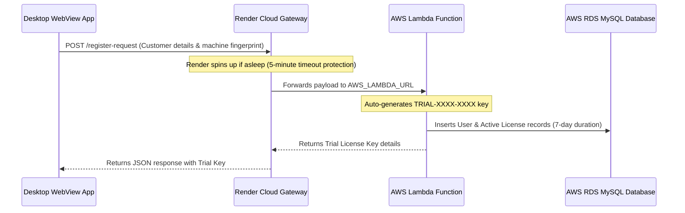

# Licensing System Documentation & Integration Guide

This document describes the modern online-syncing and monotonic-offline-decay licensing system implemented in the Tally Automation Suite.

---

## 1. Registration Flow

The registration flow uses a **Reverse Proxy Gateway** pattern to decouple the client desktop application from the AWS Lambda function URL:

### Purpose of the Render Gateway Proxy:
* **Zero Client Rebuilds:** If the AWS Lambda URL changes (e.g. switching AWS accounts), you only need to update the `AWS_LAMBDA_URL` environment variable in your Render dashboard. The compiled client app continues working immediately without updates.
* **Aesthetics & Obfuscation:** The client app never exposes any raw AWS Lambda URLs. It only communicates with your public Render gateway.

---

## 2. Licensing Endpoints & Routes

The client application communicates with the following endpoints on the Render server:

### A. Login & Activation (`/api/activate`)
* **Trigger:** Customer enters their key in the **Login Console** and clicks Login.
* **Workflow:**
  1. The client sends the key and device fingerprint (`machine_hash`) to Render.
  2. Render verifies the key against the database, binds the license to the fingerprint, sets status to `Active`, and records the exact activation time in UTC.
  3. Returns the secure, absolute server UTC time (`server_time`) and expiry time (`expiry_unix`).
  4. The client creates a local XOR-encrypted `.lic` file containing the validation metadata.

### B. Restore License (`/api/restore-device`)
* **Trigger:** Customer has deleted the `.lic` file, modified it, or moved to a new installation and clicks **Restore License**.
* **Workflow:**
  1. The client sends the local machine fingerprint to Render.
  2. Render queries the RDS database for the latest active license associated with this fingerprint.
  3. Returns the license details, key, and server Unix timestamps.
  4. The client regenerates and saves the encrypted `.lic` file, immediately unlocking the application.

### C. Renewal Request (`/api/request-renewal`)
* **Trigger:** Customer enters their expired key and requests renewal.
* **Workflow:**
  1. Checks if a renewal request is already pending.
  2. Inserts a new renewal request record (` renewal_requests`) into the database for admin approval.

---

## 3. Internet Connectivity & Offline Mode

The licensing engine is designed to balance cloud-based security with offline usability.

### A. Is Internet compulsory?
* **For Startup & Login:** **Yes.** The app requires an active internet connection on startup to perform its initial check-in (validating the session status) and during manual login/restoration.
* **For Conversions/Usage:** **No.** Once the user logs in and the `.lic` file is created, the app can run completely offline.

### B. How does the app track time offline?
To prevent users from rolling back their Windows system clock to bypass license expiration, the engine utilizes a **monotonic tick ledger**:

1. **Monotonic Baseline:** On startup, the app records the starting monotonic cycle tick:
   $$\text{Baseline Monotonic} = \text{time.monotonic()}$$
2. **Offline Decay Calculation:** The current elapsed time is progressed purely based on relative CPU ticks:
   $$\text{Current Time} = \text{Server Time Baseline} + (\text{time.monotonic()} - \text{Baseline Monotonic})$$
3. **Anti-Tampering:** Since `time.monotonic()` measures CPU clock cycles directly from the hardware, it cannot be rolled back, paused, or altered by changing the Windows system clock.
4. **Persistent State:** As the app runs, it continuously saves the updated `Actual_offline_time` to the local encrypted `.lic` file. 

> [!IMPORTANT]
> If a user shuts down the computer or closes the app, the monotonic clock resets. On the next launch, the application **requires internet connection** to verify that the saved `Actual_offline_time` matches the database, anchoring a new secure start timestamp.
